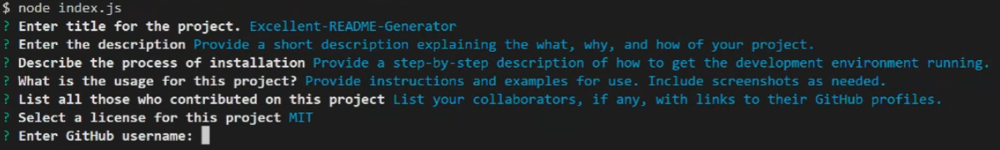

# Excellent-README-Generator

# Description
A simple node based application that is designed to create a README.md file with just a few questions.

## Table of Contents
* [Installation](#installation)
* [Usage](#usage)
* [Description](#description)
* [Contributors](#contributors)
* [Tests](#tests)

# Video Walkthrough
[Short Walkthrough Video](https://drive.google.com/file/d/1Viq1cAbHA0t3MQ_U5iL_-DeXSZEIlEk8/view)

## Installation
Download Node.js
Install Inquirer
## Usage 
After proper installation, the app can be run using node index.js in the command line. You will be asked a series of questions to answer. Once completed a “README.md” file will be created in the “output” folder.## Contributors 
List your collaborators, if any, with links to their GitHub profiles.
## GitHub 
 [Ally27](https://github.com/Ally27) 
## Email 
allysonmg21@gmail.com
## Deployed application
[Excellent README Generator](https://ally27.github.io/Excellent-README-Generator/)

## License  
[MIT License](https://opensource.org/licenses/MIT)
Copyright (c) 2023 Allyson Gonzales

Permission is hereby granted, free of charge, to any person obtaining a copy of this software and associated documentation files (the “Software”), to deal in the Software without restriction, including without limitation the rights to use, copy, modify, merge, publish, distribute, sublicense, and/or sell copies of the Software, and to permit persons to whom the Software is furnished to do so, subject to the following conditions:

The above copyright notice and this permission notice shall be included in all copies or substantial portions of the Software.

THE SOFTWARE IS PROVIDED “AS IS”, WITHOUT WARRANTY OF ANY KIND, EXPRESS OR IMPLIED, INCLUDING BUT NOT LIMITED TO THE WARRANTIES OF MERCHANTABILITY, FITNESS FOR A PARTICULAR PURPOSE AND NONINFRINGEMENT. IN NO EVENT SHALL THE AUTHORS OR COPYRIGHT HOLDERS BE LIABLE FOR ANY CLAIM, DAMAGES OR OTHER LIABILITY, WHETHER IN AN ACTION OF CONTRACT, TORT OR OTHERWISE, ARISING FROM, OUT OF OR IN CONNECTION WITH THE SOFTWARE OR THE USE OR OTHER DEALINGS IN THE SOFTWARE.
